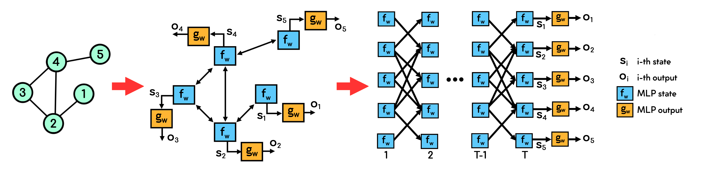
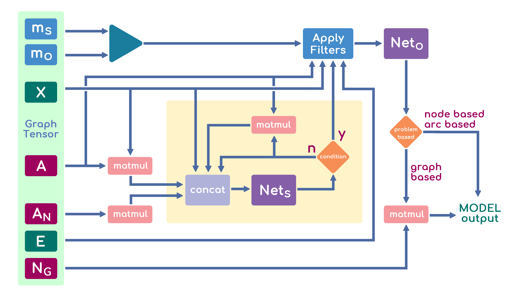
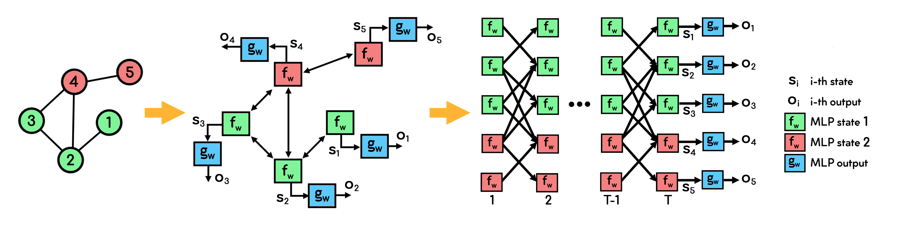
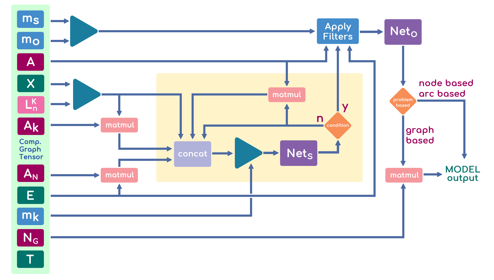

# GNN & LGNN - Graph Neural Network Keras-based Models
This repo contains Tensorflow 2.x keras-based implementations of the following models: 
- **GNN:** Graph Neural Network for homogeneous graphs;
- **LGNN:** Layered Graph Neural Network for homogeneous graphs;
- **CGNN:** Composite Graph Neural Network for heterogeneous graphs;
- **CLGNN:** Composite Layered Graph Neural Network for heterogeneous graphs;

**Authors**
- **GNN/CGNN:** [Niccolò Pancino](http://sailab.diism.unisi.it/people/niccolo-pancino/), [Pietro Bongini](http://sailab.diism.unisi.it/people/pietro-bongini/)
- **LGNN/CLGNN:** Niccolò Pancino

## Install
### Requirements
The GNN framework requires the packages **tensorflow** and **numpy**.

To install the requirements you can use the following command:

    pip install -U -r requirements.txt

### Install from folder
Download this folder and open a terminal in its location, then use the following command:
    
    python setup.py install

---------
## Homogeneous Setting
In the following scripts, gnn is a GNN trained by default to solve a binary graph-focused classification task on the real-world graphs dataset MUTAG ([details](https://github.com/NickDrake117/GNN_tf_2.x/blob/main/MUTAG_raw/Mutagenicity_label_readme.txt)), while lgnn is a 5-layered GNN.

Open the script `starter.py` and set parameters in section *SCRIPT OPTIONS* to change dataset and/or GNN/LGNN models architectures and learning behaviour.

Note that a single layered LGNN behaves esactly like a GNN, as it is composed of a single GNN.

As shown in the figure, the GNN model replicates the topology of the input graph using two MLPs as building blocks and creating a so-called encoding network. 
One MLP implements a state transition function on each node and the other implements an output function where it is needed.
The model unfolds itself in time and space, by replicating the same MLP architectures on nodes and by iterating until the converegence or a maximum number of iteration are reached. In the resulting feedforward network, called unfolding network, each layer corresponds to an instant in time and contains a copy of all the elements of the encoding network, on which the connections between the various layers also depend. In the figure, one homogeneous graph with therefore a unique type of nodes, in light green.

## GraphObject/GraphTensor data type and input data type
GraphObject and GraphTensors are the data type the models are based on: open `GNN/graph_class.py` for details. 
GraphObject and GraphTensor are essentially the same object, but they differ in the data type used for their attributes: GraphObject is described by numpy arrays and GraphTensor -- as the name suggests -- by tensorflow tensors.
The models require the input data to be a tf.keras.utils.Sequence, as specified in `GNN/Sequencers/GraphSequencers.py`, for training/testing purpose.
A Graph Sequencer is a data manager for fitting to a sequence of data – such as a dataset of graphs – which is fed with GraphObjects to generate batches of GraphTensors, whose attributes are presented as input to the givenGNNkeras model.

## Operating scheme for a GNN model

## Single model training and testing
LGNN can be trained in parallel, serial or residual mode. 

- *Serial Mode*: GNNs layers are trained separately, one by one; Each GNN layer is trained as a standalone GNN model, therefore becoming an *expert* which solves the considered problem using the original data and the experience obtained from the previous GNN layer, so as to "correct" the errors made by the previous network, rather than solving the whole problem.

- *Parallel Mode*: GNN layers are trained simultaneously, by processing loss on the output of each GNNs layers, e.g. `loss = sum( loss_function(targets, oi) for oi in gnns_layers_output)` and backpropagating the error throughout the GNN layers;

- *Residual Mode*: GNN layers are trained simultaneously, by processing loss on the sum of the outputs of all GNNs layers, e.g. `loss = loss_function(targets, sum(oi for oi in gnns_layers_output))` and backpropagating the error throughout the GNN layers.

Training mode can be set when calling `LGNN.compile()` method. Default value is `parallel`.

To perform models training and testing, run:
    
    # note that gnn and lgnn are already compiled in starter.py. In particular, lgnn is compiled to learn in 'parallel mode'
    from starter import gnn, lgnn, gTr_Sequencer, gTe_Sequencer, gVa_Sequencer
    
    epochs = 200
    
    # GNN learning procedure
    gnn.fit(gTr_Sequencer, epochs=epochs, validation_data=gVa_Sequencer)
    
    # GNN evaluation procedure
    res = gnn.evaluate(gTe_Sequencer, return_dict=True)
    

    # LGNN learning procedure in parallel mode
    # lgnn.fit(gTr_Sequencer, epochs=epochs, validation_data=gVa_Sequencer)
    
    # LGNN evaluation procedure
    # res = lgnn.evaluate(gTe_Sequencer, return_dict=True)
    

    # print evaluation result
    for i in res:  
        print(f'{i}: \t{res[i]:.4g}')

***NOTE** uncomment lgnn lines to train and test lgnn model in parallel mode. Set 'training_mode' argument to change learning behaviour*
    
---------
## Heterogeneous Setting
In the following scripts, gnn is a GNN trained by default to solve a binary graph-focused classification task on the real-world graphs dataset MUTAG ([details](https://github.com/NickDrake117/GNN_tf_2.x/blob/main/MUTAG_raw/Mutagenicity_label_readme.txt)), while lgnn is a 5-layered GNN.

Open the script `starter_composite.py` and set parameters in section *SCRIPT OPTIONS* to change dataset and/or GNN/LGNN models architectures and learning behaviour.

Note that a single layered LGNN behaves esactly like a GNN, as it is composed of a single GNN.

As shown in the figure, the Composite GNN model replicates the topology of the input heterogeneous graph using N+1 MLPs as building blocks and creating a so-called **encoding network**. N MLPs (1 for each node type) implement a state transition function on each node and 1 implements an output function where it is needed. The model unfolds itself in time and space, by replicating the same MLP architectures on nodes and by iterating until the converegence or a maximum number of iteration are reached. In the resulting feedforward network, called **unfolding network**, each layer corresponds to an instant in time and contains a copy of all the elements of the encoding network, on which the connections between the various layers also depend. In the figure, a composite graph with two type of nodes, green and red.

## Composite GraphObject/GraphTensor data type and input data type
Composite GraphObject and Composite GraphTensors are the data type the composite models are based on: open `GNN/composite_graph_class.py` for details. 
Composite GraphObject and Composite GraphTensor are essentially the same object, but they differ in the data type used for their attributes: Composite GraphObject is described by numpy arrays and Composite GraphTensor -- as the name suggests -- by tensorflow tensors.
The models require the input data to be a tf.keras.utils.Sequence, as specified in `GNN/Sequencers/GraphSequencers.py`, for training/testing purpose.
A Graph Sequencer is a data manager for fitting to a sequence of data – such as a dataset of graphs – which is fed with GraphObjects to generate batches of GraphTensors, whose attributes are presented as input to the givenGNNkeras model.

## Operating scheme for a CGNN model

## Single model training and testing
Composite LGNN can be trained in parallel, serial or residual mode, as specified in the Homogeneous case. See above for details. 

To perform models training and testing, run:
    
    # note that gnn and lgnn are already compiled in starter.py. In particular, lgnn is compiled to learn in 'parallel mode'
    from starter_composite import gnn, lgnn, gTr_Sequencer, gTe_Sequencer, gVa_Sequencer
    
    epochs = 200
    
    # CGNN learning procedure
    gnn.fit(gTr_Sequencer, epochs=epochs, validation_data=gVa_Sequencer)
    
    # CGNN evaluation procedure
    res = gnn.evaluate(gTe_Sequencer, return_dict=True)
    

    # CLGNN learning procedure in parallel mode
    # lgnnfit(gTr_Sequencer, epochs=epochs, validation_data=gVa_Sequencer)
    
    # LGNN evaluation procedure
    # res = lgnn.evaluate(gTe_Sequencer, return_dict=True)
    

    # print evaluation result
    for i in res:  
        print(f'{i}: \t{res[i]:.4g}')

***NOTE** uncomment lgnn lines to train and test lgnn model in parallel mode. Set 'training_mode' argument to change learning behaviour*

## Citing
### GNN original paper
To cite GNN please use the following publication:

    F. Scarselli, M. Gori,  A. C. Tsoi, M. Hagenbuchner, G. Monfardini, 
    "The Graph Neural Network Model", IEEE Transactions on Neural Networks,
    vol. 20(1); p. 61-80, 2009.
    
Bibtex:

    @article{Scarselli2009TheGN,
      title={The Graph Neural Network Model},
      author={Franco Scarselli, Marco Gori, Ah Chung Tsoi, Markus Hagenbuchner, Gabriele Monfardini},
      journal={IEEE Transactions on Neural Networks},
      year={2009},
      volume={20},
      pages={61-80}
    }

---------
### LGNN original paper
To cite LGNN please use the following publication:

    N. Bandinelli, M. Bianchini and F. Scarselli, 
    "Learning long-term dependencies using layered graph neural networks", 
    The 2010 International Joint Conference on Neural Networks (IJCNN), 
    Barcelona, 2010, pp. 1-8, doi: 10.1109/IJCNN.2010.5596634.
    
Bibtex:

    @inproceedings{Scarselli2010LGNN,
      title={Learning long-term dependencies using layered graph neural networks}, 
      author={Niccolò Bandinelli, Monica Bianchini, Franco Scarselli},
      booktitle={The 2010 International Joint Conference on Neural Networks (IJCNN)}, 
      year={2010},
      volume={},
      pages={1-8},
      doi={10.1109/IJCNN.2010.5596634}
    }
